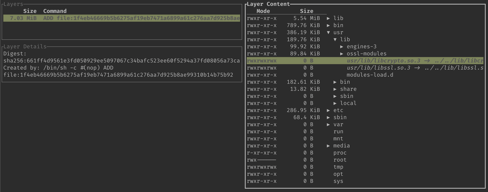

# Sink #

A toolkit to interact with and analyze OCI images.

This tool was initially written with the intention to provide a snappier [dive](https://github.com/wagoodman/dive); the name being a pessimistic homage.

It does a few more things, like being able to download a set of related-images while deduplicating layers.

## Usage ##

```
Usage: sink <COMMAND>

Commands:
  download       Download an image-set from a registry to local tar-balls
  delta          Create a tarball for an image, sans any layers present in another image. This can be used to deliver small "patches" containing only layers appeneded to an existing image
  analyze        Analyze an image. If no `output` is specified, the results will be shown in a TUI, otherwise they will be written to the specified path in JSON format
  show-analysis
  help           Print this message or the help of the given subcommand(s)

Options:
  -h, --help     Print help
  -V, --version  Print version
```

Notes:
 - `download` and `delta` work with a registry, but not with a local daemon
 - `analyze` works with a downloaded image, but not with a registry spec
 - `show-analysis` can view files saved with `analyze`


### Example Usage ###
```
❯ sink download alpine
Downloading layers
sha256:661ff4d9561e3fd050929ee5097067c34bafc523ee60f5294a37fd08056a73ca        100% ████████████████████████████████████████ 14.82 MiB/s
Generating `alpine:latest.tar`

❯ sink analyze ./alpine:latest.tar
```



